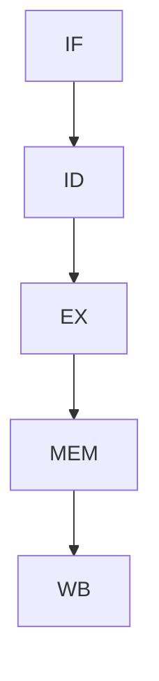

# 网站内容修改指南

这份指南面向**没有前端开发经验的小白**，告诉你如何修改这个网站的各项内容。

## 目录

1. [项目结构速览](#1-项目结构速览)
2. [修改个人信息](#2-修改个人信息)
3. [发布新博客文章](#3-发布新博客文章)
4. [修改项目展示](#4-修改项目展示)
5. [修改 About 页面](#5-修改-about-页面)
6. [修改颜色与主题](#6-修改颜色与主题)
7. [修改字体](#7-修改字体)
8. [修改动画效果](#8-修改动画效果)
9. [修改首页 Hero 文案](#9-修改首页-hero-文案)
10. [添加/删除导航栏](#10-添加删除导航栏)
11. [代码高亮主题](#11-代码高亮主题)
12. [日常使用流程](#12-日常使用流程)

---

## 1. 项目结构速览

```
my_website/
├── app/                ← 各页面的页面文件
│   └── globals.css     ← **全局样式（颜色、字体、滚动条等）**
│   └── layout.tsx      ← **网站的整体框架（标题栏、页脚等）**
│   └── page.tsx        ← **首页**
│   └── blog/           ← 博客列表和文章详情页
│   └── about/          ← About 页面
│   └── projects/       ← 项目展示页面
│   └── contact/        ← 联系页面
├── components/         ← 可复用的 UI 组件
│   └── layout/         ← 头部导航栏、页脚、主题切换
│   └── blog/           ← 博客相关组件
│   └── ui/             ← 基础 UI 组件（按钮、卡片等）
├── content/
│   └── blog/           ← **所有博客文章 (.mdx 文件)**
├── lib/
│   └── constants.ts    ← **个人信息、技能、教育、社交链接**
├── public/
│   └── images/         ← 图片资源
└── tailwind.config.ts  ← **动画定义、字体定义**
```

你需要修改的文件**不超过 5 个**，大部分都集中在 `lib/constants.ts` 和 `content/blog/` 里。

---

## 2. 修改个人信息

**文件**：`lib/constants.ts`

这是你**最常需要修改**的文件，网站的名字、邮箱、社交链接、技能、教育经历都在这里。

```typescript
// 网站基本信息
export const SITE_CONFIG = {
  name: 'Kai Weng',              // ← 改成你的名字
  title: 'Tech Blog',            // ← 网站标题（浏览器标签显示）
  description: 'Personal technical blog...', // ← SEO 描述
  url: 'https://kaiweng.dev',    // ← 你的域名
  author: {
    name: 'Kai Weng',            // ← 作者名
    email: 'kai@example.com',    // ← 改成真实邮箱
    github: 'https://github.com/kaiweng',   // ← 改成你的 GitHub
    linkedin: 'https://linkedin.com/in/kaiweng',
    twitter: 'https://twitter.com/kaiweng',
  },
};

// 技术栈标签（展示在首页）
export const TECH_STACK = [
  'Verilog', 'SystemVerilog', 'Chisel', 'VHDL',
  'Python', 'C++', 'Tcl', 'Bash',
  // ↑ 改成你实际的技术栈
];

// 技能详情（展示在 About 页面）
export const SKILLS = [
  { category: 'Digital Design', items: ['RTL Design', 'Verification', ...] },
  { category: 'Architecture', items: ['Cache Design', ...] },
  // ↑ 按你的实际情况修改
];

// 教育经历（展示在 About 页面）
export const EDUCATION = [
  {
    degree: 'M.S. in Electrical Engineering',
    school: 'University of Science and Technology',
    period: '2023 - 2026',
    description: 'Research focus on NPU architecture...',
  },
  // ↑ 改成你的真实教育经历
];
```

---

## 3. 发布新博客文章

这是你**最高频**的操作，步骤如下：

### 第 1 步：创建文件

在 `content/blog/` 下新建一个 `.mdx` 文件，例如 `my-article.mdx`。

### 第 2 步：写文章头信息（Frontmatter）

```yaml
---
title: '文章标题'
description: '简短描述（会显示在搜索结果和预览卡片中）'
date: '2025-07-15'
tags: ['Verilog', 'FPGA', 'Digital Design']
category: 'Hardware Design'
featured: false
---

你的正文内容从这里开始...
```

### 第 3 步：用 Markdown 写正文

文章支持普通 Markdown 语法，还额外支持：

**数学公式**（LaTeX）：
```markdown
行内公式：$E = mc^2$

单独成行：$$f(x) = \int_{-\infty}^{\infty} \hat{f}(\xi) e^{2\pi i \xi x} d\xi$$
```

**代码块（带语法高亮）**：
````markdown
```verilog
module counter(
    input wire clk,
    input wire rst_n,
    output reg [7:0] count
);
    always @(posedge clk or negedge rst_n) begin
        if (!rst_n) count <= 8'd0;
        else        count <= count + 1'b1;
    end
endmodule
```
````

**Mermaid 图表**：
````markdown

````

**图片**：
```markdown

```
→ 图片文件放在 `public/images/` 下

### 第 4 步：提交推送

```bash
git add content/blog/my-article.mdx
git commit -m "post: 关于 XXX 的新文章"
git push origin main
```

推送后 Vercel 会自动部署，约 60 秒后上线。

---

## 4. 修改项目展示

**文件**：`app/projects/page.tsx`

找到文件中的 `projects` 数组（大约在第 28 行），按格式添加/修改/删除项目：

```typescript
{
  title: '项目名称',
  description: '一句话描述这个项目',
  tech: ['技术1', '技术2', '技术3'],
  github: 'https://github.com/你的用户名/仓库名',
  status: 'active',          // 可选：'active' | 'completed' | 'archived'
  details: [
    '第一行亮点',
    '第二行亮点',
    '第三行亮点',
  ],
},
```

状态对应的颜色：
- `active` → 绿色（进行中）
- `completed` → 蓝色（已完成）
- `archived` → 灰色（已归档）

---

## 5. 修改 About 页面

**文件**：`app/about/page.tsx`

这个页面的大部分内容从 `lib/constants.ts` 读取（技能、教育），但**个人简介**在 `about/page.tsx` 文件中，直接修改即可：

```tsx
<p>
  I started my journey in hardware design during undergrad...
</p>
<p>
  My current research focuses on NPU architecture...
</p>
```

就改 `<p>...</p>` 里面的文字内容。

---

## 6. 修改颜色与主题

**文件**：`app/globals.css`（第 7-37 行）

网站的颜色通过 **CSS 变量**控制，分离了浅色模式和深色模式：

```css
:root {                          /* 浅色模式 */
  --background: 0 0% 100%;       /* 背景白 */
  --foreground: 240 10% 3.9%;    /* 文字深灰 */
  --muted: 240 4.8% 95.9%;       /* 浅灰色（用于卡片、标签背景） */
  --muted-foreground: 240 3.8% 46.1%;  /* 灰色文字 */
  --card: 0 0% 100%;             /* 卡片背景 */
  --border: 240 5.9% 90%;        /* 边框颜色 */
  --primary: 240 5.9% 10%;       /* 主色调 */
}

.dark {                          /* 深色模式 */
  --background: 0 0% 3.9%;       /* 背景黑 */
  --foreground: 0 0% 98%;        /* 文字白 */
  --muted: 0 0% 12%;             /* 深灰色 */
  /* ... */
}
```

### 颜色值的格式

颜色使用 HSL 格式：`h s% l%`
- `h` = 色相（0-360），红色=0，绿色=120，蓝色=240
- `s` = 饱和度（0-100）
- `l` = 亮度（0-100），越高越白

### 举例：换一个配色方案

如果你想换成淡蓝色调（浅色模式下），改 `:root` 里的值：

```css
:root {
  --background: 210 20% 98%;      /* 淡蓝白背景 */
  --foreground: 240 10% 10%;
  --primary: 210 80% 40%;         /* 蓝色主色调 */
  --accent: 210 40% 94%;
  /* ... */
}
```

深色模式同理，改 `.dark` 里的对应变量。

### 网站默认为深色模式

在 `app/layout.tsx` 第 67 行：
```tsx
<ThemeProvider attribute="class" defaultTheme="dark" enableSystem={false}>
```

- `defaultTheme="dark"` → 默认深色模式，想默认浅色就改成 `"light"`
- 用户可以通过页面右上角的按钮手动切换

---

## 7. 修改字体

**文件**：`app/globals.css`（第 5 行）

```css
@import url('https://fonts.googleapis.com/css2?family=Inter:wght@400;500;600;700&family=JetBrains+Mono:wght@400;500;600&display=swap');
```

- `Inter` → 正文字体
- `JetBrains Mono` → 代码字体

如果想换字体，去 [fonts.google.com](https://fonts.google.com) 挑选，替换 `family=FontName` 即可。例如换成中文友好的字体：

```css
/* Noto Sans SC（正文）+ JetBrains Mono（代码） */
@import url('https://fonts.googleapis.com/css2?family=Noto+Sans+SC:wght@400;500;700&family=JetBrains+Mono:wght@400;500;600&display=swap');
```

然后在 `tailwind.config.ts` 中对应修改 `fontFamily.sans` 的值。

---

## 8. 修改动画效果

**文件**：`tailwind.config.ts`（第 46-68 行）

网站预定义了 4 种动画：

| 动画名 | 效果 | 适用场景 |
|--------|------|---------|
| `animate-fade-in` | 淡入 | 页面加载 |
| `animate-fade-up` | 淡入 + 向上浮动 20px | 段落逐个出现 |
| `animate-slide-in` | 从左侧滑入 | 侧边栏、菜单 |
| `animate-scale-in` | 缩放弹出 | 弹窗、模态框 |

### 调整动画速度

在 `tailwind.config.ts` 中修改 `duration`（持续时间）：

```typescript
'fade-in': 'fadeIn 0.5s ease-out',   // 0.5 秒，改成 1s 就是 1 秒
'fade-up': 'fadeUp 0.5s ease-out',
```

### 给某个元素加动画

在页面文件的标签上加上 `className="animate-fade-in"` 即可。例如 `lib/constants.ts` 中并没有直接用到，主要在各 `page.tsx` 中：

```tsx
<div className="mx-auto max-w-5xl px-6 py-12 animate-fade-in">
```

### 禁用所有动画

在 `app/globals.css` 末尾加入：

```css
*, *::before, *::after {
  animation-duration: 0s !important;
}
```

---

## 9. 修改首页 Hero 文案

**文件**：`app/page.tsx`（第 17-57 行）

直接修改 `<h1>`、`<p>` 标签内的文字：

```tsx
<h1 className="...">
  <span>Hi, I&apos;m </span>
  <span>Kai Weng</span>           // ← 改名字
</h1>

<p className="...">
  Digital IC design engineer...   // ← 改写个人介绍
</p>
```

"I&apos;m" 中的 `&apos;` 是 HTML 里的单引号，不用改它。

---

## 10. 添加/删除导航栏

**文件**：`lib/constants.ts`

```typescript
nav: [
  { label: 'Blog', href: '/blog' },
  { label: 'Projects', href: '/projects' },
  { label: 'About', href: '/about' },
  { label: 'Contact', href: '/contact' },
],
```

- **添加**：在数组中加一项 `{ label: '显示名', href: '/路径' }`，然后创建对应的页面文件 `app/路径/page.tsx`
- **删除**：直接从数组中移除那一行即可

---

## 11. 代码高亮主题

**文件**：`app/globals.css`（第 76-83 行）

代码块目前使用 **Tokyo Night Dark** 配色，背景色在这里：

```css
pre {
  background: #1a1b26 !important;    /* 改成你想要的颜色 */
  border-radius: 0.75rem !important; /* 圆角大小 */
  padding: 1.25rem !important;       /* 内间距 */
}
```

---

## 12. 日常使用流程

每次想修改网站时：

```bash
# 1. 进入项目目录
cd "C:\Users\weng xinkai\Desktop\claude code\my_website"

# 2. 启动本地开发服务器，在浏览器预览修改效果
npm run dev
# 浏览器打开 http://localhost:3000

# 3. 修改文件 → 保存 → 浏览器自动刷新 → 确认效果满意

# 4. 提交并推送
git add -A
git commit -m "描述你做了什么修改"
git push origin main

# 5. Vercel 自动部署，1 分钟后上线
```

> 开发服务器在后台运行时，按 `Ctrl+C` 可以停止它。

---

## 快速参考卡片

| 我想改... | 打开这个文件 |
|-----------|-------------|
| 名字、邮箱、社交链接 | `lib/constants.ts` |
| 技术栈标签 | `lib/constants.ts` |
| 技能列表 | `lib/constants.ts` |
| 教育经历 | `lib/constants.ts` |
| 导航菜单 | `lib/constants.ts` |
| 发新博客 | `content/blog/新文章.mdx`（新建文件） |
| 项目展示 | `app/projects/page.tsx` |
| About 页个人简介 | `app/about/page.tsx` |
| 首页介绍文字 | `app/page.tsx` |
| 背景颜色 | `app/globals.css`（找 `:root` 和 `.dark`） |
| 字体 | `app/globals.css`（第 5 行） |
| 动画速度 | `tailwind.config.ts` |
| 代码块颜色 | `app/globals.css`（`pre` 部分） |
| 深色/浅色默认模式 | `app/layout.tsx`（`defaultTheme`） |
